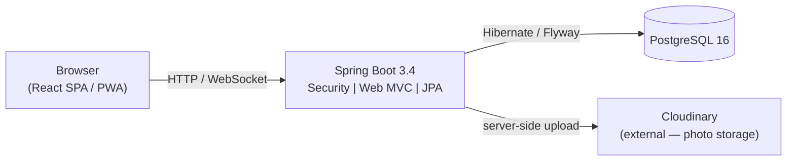
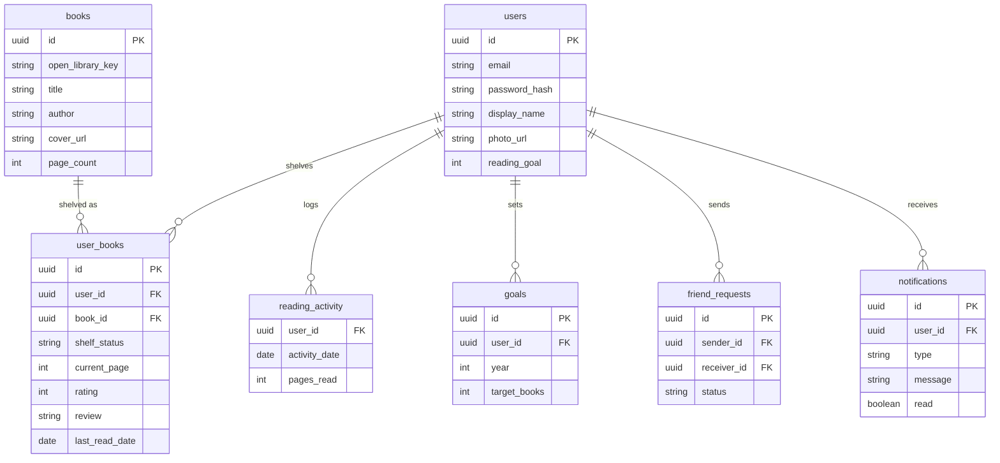

# BookTracker

[](https://github.com/KatlegoNgobeni/booktracker/actions/workflows/ci.yml)
[](https://booktracker-m0tr.onrender.com)

> Your Goodreads, done right. A mobile-first PWA to log books, track reading progress, set yearly goals, and stay connected with what your friends are reading.

<!-- Screenshot: take from the live app (https://booktracker-m0tr.onrender.com) and save to docs/screenshot.png -->


**Live demo:** [https://booktracker-m0tr.onrender.com](https://booktracker-m0tr.onrender.com)
Login: `demo@booktracker.app` / `demo1234`

> **Note:** Free-tier Render cold-start takes ~30 seconds after idle. This is expected — just wait for the app to load.

---

## Features

- **Shelf management** — Want to Read, Currently Reading, Read, DNF with one-tap status changes
- **Reading progress** — Log pages read, see a visual progress bar, mark books finished
- **Stats & streaks** — Current/longest reading streak, monthly pace chart, ahead/behind-goal verdict
- **Goal tracking** — Set a yearly reading target; see live progress and a finish-by date projection
- **Social layer** — Mutual friend connections, friends-reading feed, friend requests with real-time notifications (WebSocket)
- **Discovery feed** — See what friends are reading plus trending books from Open Library
- **Profile photos** — Upload your own photo via Cloudinary; generated avatars (DiceBear) as fallback
- **PWA** — Install on iPhone or Android; auto-updates via service worker; offline-cached covers and avatars

---

## Quick start (local)

**Prerequisites:** Docker and Docker Compose

```bash
git clone https://github.com/KatlegoNgobeni/booktracker.git
cd booktracker
cp .env.example .env
# Edit .env — fill in POSTGRES_PASSWORD, JWT_SECRET, and CLOUDINARY_* values
docker compose up
# App available at http://localhost:8080
```

The app runs as a bundled monolith — the Spring Boot JAR serves both the REST API (`/api/**`) and the React SPA (`/`). Flyway runs migrations automatically on startup.

To generate a JWT secret:
```bash
openssl rand -base64 48
```

---

## Tech stack

| Layer | Technology |
|-------|-----------|
| Backend | Java 21, Spring Boot 3.4, Spring Security 6, Flyway 10, PostgreSQL 16 |
| Frontend | React 18, Vite 5, TanStack Query 5, Tailwind CSS, PWA (vite-plugin-pwa) |
| Auth | JWT + BCrypt (stateless — tokens in `localStorage`, no sessions) |
| Media | Cloudinary (server-side photo upload proxy — no client-exposed credentials) |
| Real-time | WebSocket / STOMP over SockJS with JWT channel interceptor |
| Testing | JUnit 5 + Testcontainers, Vitest + RTL, Playwright E2E |
| Deploy | Render (Docker web service + managed PostgreSQL 16) |

---

## Architecture



**Bundled monolith:** The Vite build output is embedded into the Spring Boot fat JAR at Docker build time (Stage 1 → Node/Vite, Stage 2 → Maven, Stage 3 → JRE). Frontend and API share the same origin — no CORS needed.

**SPA routing:** A `WebMvcConfigurer` forwards all extension-free routes to `index.html` so React Router's `BrowserRouter` works in production.

---

## Database schema



---

## Engineering highlights

Four design decisions worth discussing in an interview:

**1. 403 vs 404 for ownership violations**

`ShelfController.getEntry()` returns `403 Forbidden` when a shelf entry exists but belongs to a different user. A naive implementation would return `404 Not Found`, which an attacker could use to enumerate other users' library entries by probing IDs. Returning 403 confirms the resource exists without leaking any content — a standard information-hiding pattern.

**2. Server-assigned activity dates**

Every row in `reading_activity` uses `LocalDate.now()` assigned on the server; the client never sends a date in the request body. This prevents a client from backdating progress logs to manufacture a fake reading streak. The streak calculation is therefore trustworthy because the timestamps are authoritative.

**3. FOUC-free dark mode**

A three-layer CSS variable + `data-theme` approach: the saved theme preference is read from `localStorage` and applied as `document.documentElement.setAttribute('data-theme', ...)` by a small `<script>` tag in `index.html` that runs synchronously before React hydrates. This eliminates the flash of unstyled (wrong-theme) content (FOUC) that occurs when the theme is applied after the React component tree mounts.

**4. Auth-boundary cache teardown**

`clearAuthSession(queryClient)` wipes the TanStack Query in-memory cache **and** the service worker's `api-cache` storage at every auth boundary: sign-out, 401 force-logout, and after login/register. Without this, a second user logging in on the same device would see the first user's cached data — a cross-user data leak. Tying the cache flush to the auth lifecycle makes this impossible.

---

## CI / CD

Every push triggers `.github/workflows/ci.yml`:

1. **Backend tests:** `mvn verify -B` — JUnit 5 + Testcontainers against a real PostgreSQL 16 container.
2. **Frontend build:** `npm ci && npm run build` — TypeScript type-check (`tsc -b`) + Vite compile.
3. **E2E (main only):** Playwright suite boots the bundled JAR, seeds users via `/api/auth/register`, and runs 8 Chromium tests covering auth smoke + core reading loop + two-user auth boundary.
4. **Deploy (main only):** Calls the Render deploy hook via `curl --fail` (URL stored as the `RENDER_DEPLOY_HOOK_URL` Actions secret — never in code).

---

## Environment variables

| Variable | Where set | Description |
|----------|-----------|-------------|
| `POSTGRES_DB` | `.env` (local only) | PostgreSQL database name |
| `POSTGRES_USER` | `.env` (local only) | PostgreSQL username |
| `POSTGRES_PASSWORD` | `.env` / Render | PostgreSQL password |
| `SPRING_DATASOURCE_URL` | Render Environment tab | JDBC URL: `jdbc:postgresql://<host>:<port>/<db>` |
| `SPRING_DATASOURCE_USERNAME` | Render Environment tab | PostgreSQL username |
| `SPRING_DATASOURCE_PASSWORD` | Render Environment tab | PostgreSQL password |
| `JWT_SECRET` | `.env` / Render | Long random string — `openssl rand -base64 48` |
| `CLOUDINARY_CLOUD_NAME` | `.env` / Render | Cloudinary account cloud name |
| `CLOUDINARY_API_KEY` | `.env` / Render | Cloudinary API key |
| `CLOUDINARY_API_SECRET` | `.env` / Render | Cloudinary API secret (server-side only — never sent to browser) |
